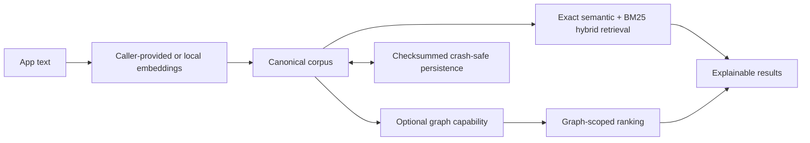

# VectorKit

## Fast, private retrieval for edge AI

VectorKit is the local-first retrieval foundation for Swift and Python apps:
exact semantic search, BM25-powered hybrid ranking, metadata filtering,
graph-scoped retrieval, and crash-safe persistence through one shared Rust
core.

[](https://www.rust-lang.org/)
[](https://www.swift.org/)
[](https://www.python.org/)
[](https://developer.apple.com/ios/)
[](https://developer.apple.com/macos/)

**[Run from source](#run-from-source)** · **[See validated benchmarks](#measured-proof)**

VectorKit keeps retrieval close to your data and gives applications a compact,
capability-oriented API. Use the base package for a canonical corpus plus
semantic and hybrid retrieval. Choose the graph aggregate when your product
also needs bounded traversal and graph-scoped ranking.

## Measured proof

These are historical observations authorized by the frozen
[Phase 6 claim register](benchmarks/publication/artifacts/phase6-publication-v1/claim-register.json),
not measurements of the current checkout. They apply to VectorKit revision
`9c784d2f11b91bb907150aa1b6046880ff89fde6`, were reported on 2026-07-21,
and expire on 2027-07-21. Retrieval timings exclude embedding generation.

### Exact retrieval on Apple M1 Max

<!-- claim:P6-MAC-EXACT-001 -->
On the frozen exact F32, 384-dimensional, top-10 benchmark, VectorKit revision
`9c784d2` delivered the following P50 unfiltered retrieval ratios versus
sqlite-vec `0.1.9` on an Apple M1 Max running macOS 26.5.2. Each lane used 100
measured queries after 20 warmups; embedding was excluded.

| Corpus | sqlite-vec / VectorKit P50 | Observation |
| ---: | ---: | --- |
| 10K | 7.17× | VectorKit lower latency |
| 25K | 7.60× | VectorKit lower latency |
| 50K | 7.29× | VectorKit lower latency |
<!-- /claim -->

<!-- claim:P6-MAC-EXACT-002 -->
With the same frozen filter enabled, the P50 retrieval ratios were 10.38× at
10K, 9.08× at 25K, and 8.43× at 50K versus sqlite-vec `0.1.9`. This was the
same Apple M1 Max exact F32 workload at revision `9c784d2`; embedding was
excluded.
<!-- /claim -->

<!-- claim:P6-MAC-CORRECTNESS-001 -->
VectorKit exact F32 and sqlite-vec `0.1.9` both passed the frozen Phase 5
identity, filtering, deletion, determinism, and reload gates at 10K, 25K, and
50K. This result is scoped to the frozen workload and is not proof for every
possible input.
<!-- /claim -->

These ratios describe one exact-search workload, not universal competitor
superiority. See the [methodology](benchmarks/publication/artifacts/phase6-publication-v1/methodology.md)
and [Mac evidence report](benchmarks/publication/artifacts/phase6-publication-v1/mac-systems-performance.md).

### Graph-scoped quality on HotpotQA

<!-- claim:P6-QUALITY-001 -->
Across the frozen 296-query HotpotQA linked-abstracts test comparison,
graph-scoped weighted-I8 retrieval increased NDCG@10 from 0.858036 to 0.927909
versus whole-corpus weighted-I8 retrieval. There were 121 wins, 157 ties, and
18 losses. This is a scoped quality result, not a universal graph winner or a
latency claim.
<!-- /claim -->

<!-- claim:P6-QUALITY-002 -->
On the same frozen 296-query weighted-I8 comparison, Recall@10 increased from
0.871622 to 0.957770 and complete-evidence recall@10 increased from 0.743243 to
0.922297. Sixteen queries lost on each recall measure; those losses are part of
the result.
<!-- /claim -->

<!-- claim:P6-QUALITY-003 -->
The frozen candidate stage reduced the mean per-query candidate set by 972.65×
while retaining 96.79% candidate recall and 94.26% candidate complete evidence
across 296 valid graph queries, with zero empty scopes. Candidate reduction is
not a retrieval-latency speedup and retention was not perfect.
<!-- /claim -->

The workload contains 12,670 chunks. Full details are in the
[retrieval-quality evidence](benchmarks/publication/artifacts/phase6-publication-v1/retrieval-quality.md).

### Physical-device qualification

<!-- claim:P6-DEVICE-001 -->
On a physical iPhone 17 Pro Max (`iPhone18,2`, `V54AP`), the supported 10K,
25K, and 50K F32/I8 product workflows passed. All six graph-free
candidate-to-baseline median-session P95 ratios were at or below the frozen
1.03 gate. Query/prepare evidence used iOS 26.5.1 (23F81); remaining lifecycle
evidence used iOS 26.5.2 (23F84). This is supported-workload qualification for
that device, with embedding excluded, not a claim about other hardware.
<!-- /claim -->

<!-- claim:P6-DEVICE-SAFETY-001 -->
V1 targets fewer than 50K chunks. The 100K Phase 4b stress workload remains
`not_run_device_safety`, produced zero accepted stress artifacts, and is not
eligible for support, performance, latency, quality, product, or marketing
claims.
<!-- /claim -->

See the [physical-device evidence report](benchmarks/publication/artifacts/phase6-publication-v1/physical-device-systems-performance.md)
and [Phase 6 validation result](benchmarks/publication/artifacts/phase6-publication-v1-validation.json).

## Private by architecture

Indexing, search, filtering, graph traversal, ranking, and persistence execute
locally in the shared Rust core. VectorKit does not need a retrieval server or
network call on its query path.

Embeddings are caller-provided. To keep the complete ingestion and query flow
private, use a local embedding provider such as a Core ML model through
EmbeddingKit. If your application sends text to a remote embedding service,
that part of the flow is not local or private. See the
[local embedding integration guide](wrappers/swift/EmbeddingKit/README.md).



## Why VectorKit

- Exact semantic search and BM25-powered hybrid ranking share one corpus.
- Optional graph traversal narrows retrieval to application-defined scopes.
- Typed metadata filters are deterministic across Rust, Swift, and Python.
- Search traces expose vector, keyword, fusion, and graph decisions.
- Concurrent reads keep immutable query workloads moving safely.
- Transactional, checksummed snapshots fail closed on corruption.

## Choose your SDK

| SDK | Capability | Status |
| --- | --- | --- |
| Swift `VectorKit` | Base corpus and retrieval | **Available from source** |
| Swift `VectorKitGraph` | Graph aggregate with retrieval | **Available from source** |
| Swift `EmbeddingKit` | Local Core ML embedding integration | **Available from source** |
| Swift `VectorKitPipeline` | Chunk → embed → index → search orchestration | **Available from source** |
| Python `vectorkit` | Base corpus and retrieval | **Available from source** |
| Python `vectorkit-graph` | Graph aggregate with retrieval | **Available from source** |
| Kotlin | — | **Coming soon** |
| TypeScript | — | **Coming soon** |

The Python distributions are mutually exclusive within one process. Likewise,
Swift applications must link either the base native aggregate or the graph
native aggregate, never both. The graph package already contains the base
native capabilities.

## Run from source

The `v0.1.0` preview release candidate is source-first while licensing and
release qualification are completed.

### Python quickstart

Prerequisites: Rust, a C compiler, and Python 3.10 or newer. Build, test, and
install the local package into its isolated environment:

```bash
PYTHON_BIN=python3 scripts/check-python-wrapper.sh
target/python-wrapper-check-venv-py*/bin/python wrappers/python/examples/database_quickstart.py
```

The example uses explicit demo vectors so it is deterministic:

```python
from vectorkit import (
    RetrievalConfiguration,
    RetrievalDatabaseBuilder,
    VectorIndexConfiguration,
)

builder = RetrievalDatabaseBuilder(
    corpus_id="docs",
    retrieval=RetrievalConfiguration(
        semantic=VectorIndexConfiguration(dimension=3)
    ),
)
builder.upsert(
    {
        "record": {"id": "local-first", "record_type": "Article"},
        "chunks": [{"key": "summary", "text": "Private retrieval on device."}],
    },
    embeddings={"summary": [1.0, 0.0, 0.0]},
)
database = builder.build()
hits = database.retrieval.semantic_search([1.0, 0.0, 0.0], limit=1)
print(hits[0]["document_id"])
```

Expected output: `local-first`.

### Swift quickstart

Prerequisites: Swift 6.2/Xcode and the Rust Apple target. Build the local
macOS XCFramework, then run the tested capability-oriented example:

```bash
scripts/build-xcframework.sh --macos-only
swift run --package-path wrappers/swift/VectorKit VectorKitDatabaseQuickstart
```

```swift
import VectorKit

@main
enum DatabaseQuickstart {
  static func main() async throws {
    let builder = try RetrievalDatabase.Builder(
      corpusID: "docs",
      retrieval: RetrievalConfiguration(
        semantic: VectorIndexConfiguration(dimension: 3)
      )
    )
    try await builder.upsert(
      RecordInput(
        record: Record(id: "local-first", type: "Article"),
        chunks: [Chunk(key: "summary", text: "Private retrieval on device.")]
      ),
      embeddings: ["summary": [1, 0, 0]]
    )
    let database = try await builder.build()
    let hits = try await database.retrieval.semanticSearch(
      embedding: [1, 0, 0], topK: 1
    )
    print(hits[0].documentID)
  }
}
```

The vectors above are demo embeddings, not a production embedding model. Use
the [pipeline](wrappers/swift/VectorKitPipeline/README.md) with a local
[EmbeddingKit provider](wrappers/swift/EmbeddingKit/README.md) for private
text-to-result retrieval.

## Scope and release status

- V1 is designed for local indexes with fewer than 50K chunks.
- Initial binary qualification focuses on arm64 Apple platforms: macOS 14+ and
  iOS 15+, including the arm64 iOS Simulator.
- Installation is source-first until the release license and notices are
  owner-approved.
- Benchmark evidence supports scoped observations, not a universal competitor
  claim.
- SwiftPM and Python package publication remain blocked pending licensing,
  provisioned Phase 7 release gates, and claim authorization for the release
  revision.

## Documentation

- [Product specification](docs/product/vectorkit-product-spec.md)
- [Capability-separated architecture](docs/product/capability-separated-architecture.md)
- [Python wrapper](wrappers/python/README.md)
- [Swift wrapper](wrappers/swift/VectorKit/README.md)
- [Graph package](wrappers/swift/VectorKitGraph/README.md)
- [Release process](docs/product/release-process.md)
- [Changelog](CHANGELOG.md)
- [Contributing](CONTRIBUTING.md)
- [Security policy](SECURITY.md)

VectorKit `v0.1.0` is a preview. Public distribution has not started.
