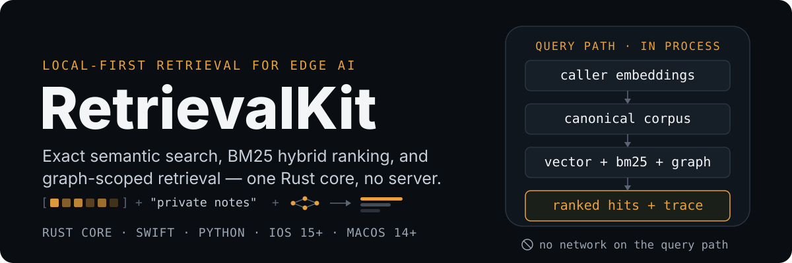
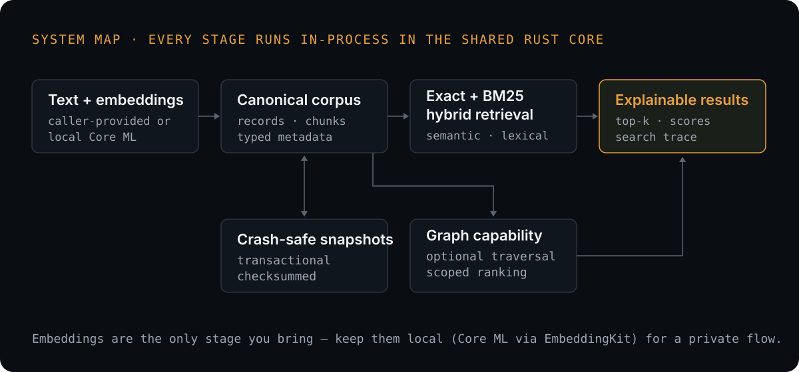

# 

RetrievalKit is one local retrieval engine for Swift, Python, TypeScript/Node,
and Kotlin apps. It combines semantic meaning with BM25 keyword evidence and can use
application-defined relationships to search only the relevant part of your
corpus. One corpus, one ranked list, one trace, and no retrieval server.

<div align="center">

[](https://www.rust-lang.org/)
[](https://www.swift.org/)
[](https://www.python.org/)
[](https://nodejs.org/)
[](https://kotlinlang.org/)
[](https://developer.apple.com/ios/)
[](https://developer.apple.com/macos/)

**[Public docs](https://retrievalkit-docs.gungorbasa.chatgpt.site)** · **[Swift guide](docs/guides/swift.md)** · **[Python guide](docs/guides/python.md)** · **[TypeScript guide](docs/guides/typescript.md)** · **[Kotlin guide](docs/guides/kotlin.md)** · **[Run from source](#run-from-source)** · **[See validated benchmarks](#measured-proof)**

</div>

## One search, the right context

Imagine a workspace with notes from many teams and projects. Someone opens
Project Apollo and asks:

> Why did we choose Swift?

RetrievalKit can use three kinds of evidence without turning them into three
different products:

1. The Apollo relationship selects notes that belong to that project.
2. A metadata rule can require `status = approved`.
3. Semantic similarity and BM25 keyword evidence rank the remaining notes.

The result is the Apollo architecture decision—not an unrelated note that
happens to mention Swift.

Graph scope is not a separate result engine or a third scoring signal. It
chooses the candidate neighborhood; the same hybrid ranker then orders those
candidates. Relationships are supplied by your application. RetrievalKit does
not automatically extract or invent a graph.

## Choose how to search

| Need | Choose |
|---|---|
| Meaning-based matching without query text | Semantic search |
| Normal app/document search | Hybrid search |
| Search inside a project, team, citation network, folder, or related records | Graph-scoped hybrid search |
| Hard tenant, status, type, or date constraints | Metadata filters with any mode |

Hybrid search should be the normal default when a user types a query: semantic
similarity catches paraphrases while BM25 preserves exact names and terms.
Choose semantic-only when there is no useful query text—such as finding records
similar to another record—or when keyword overlap should intentionally have no
effect.

Graph scope and metadata filters solve different problems. A graph answers
“what is related to this record?” A filter answers “which records satisfy this
rule?” They can be used together.

## How RetrievalKit works

<p align="center">
  
</p>

Indexing, graph traversal, filtering, ranking, trace construction, and
persistence all run in the shared Rust core. The language wrappers provide
idiomatic APIs over the same ownership model and correctness guarantees.

Embeddings are caller-provided. To keep the complete ingestion and query flow
private, use a local embedding provider such as a Core ML model through
[EmbeddingKit](wrappers/swift/EmbeddingKit/README.md). If your application
sends text to a remote embedding service, that embedding step is not local or
private, even though RetrievalKit still indexes and searches locally.

## Start with your language

The canonical guides use the same Project Apollo data and explain what to
choose, when, and why:

- **[Swift guide](docs/guides/swift.md)** — graph-scoped hybrid search, the
  simpler base package, semantic-only queries, traces, persistence, and local
  embeddings.
- **[Python guide](docs/guides/python.md)** — the same product flow with
  Pythonic builders, queries, lifecycle, and packaging.
- **[TypeScript guide](docs/guides/typescript.md)** — asynchronous Node.js
  builders and typed N-API values on macOS arm64.
- **[Kotlin guide](docs/guides/kotlin.md)** — Kotlin/JVM and Android
  arm64-v8a builders over a typed JNI boundary.

The complete programs are checked into the repository and are exercised by the
wrapper validation scripts, so the documentation stays tied to executable
examples.

## Packages and platform support

Choose the graph-enabled distribution when relationships are meaningful to
your product. It is RetrievalKit with graph capabilities included: semantic
search, BM25 hybrid ranking, filters, traces, and persistence are already
there. Choose the base distribution for flat corpora that do not need
traversal.

| SDK | Capability | Status |
| --- | --- | --- |
| Swift `RetrievalKit` | Base corpus and retrieval | **Available from source** |
| Swift `RetrievalKitGraph` | Graph aggregate with retrieval | **Available from source** |
| Swift `EmbeddingKit` | Local Core ML embedding integration | **Available from source** |
| Swift `RetrievalKitPipeline` | Chunk → embed → index → search orchestration | **Available from source** |
| Python `retrievalkit` | Base corpus and retrieval | **Available from source** |
| Python `retrievalkit-graph` | Graph aggregate with retrieval | **Available from source** |
| TypeScript `retrievalkit-node-local` | Base corpus and retrieval; provisional repository-local name | **Available from source** |
| TypeScript `retrievalkit-node-graph-local` | Graph aggregate with retrieval; provisional repository-local name | **Available from source** |
| Kotlin/JVM `retrievalkit` | Base corpus and retrieval; provisional coordinates | **Available from source** |
| Kotlin/JVM `retrievalkit-graph` | Graph aggregate with retrieval; provisional coordinates | **Available from source** |
| Android `retrievalkit-android` | Base AAR for arm64-v8a; provisional coordinates | **Available from source** |
| Android `retrievalkit-graph-android` | Graph aggregate AAR for arm64-v8a; provisional coordinates | **Available from source** |

Python, Node, and Kotlin base and graph native aggregates are mutually exclusive within one process.
Their graph-enabled distributions already contain the base native retrieval
capabilities. Node loaders enforce this with a process-global guard; JVM and
Android applications must depend on exactly one artifact.

Swift uses one package and one graph-capable native aggregate. Add the package
once, then select `RetrievalKit`, `RetrievalKitGraph`, or both products.
`RetrievalKitGraphFFI` contains the shared base and graph entry points, so a
Swift application never links competing native aggregates. Selecting only
`RetrievalKit` keeps graph APIs out of the Swift target, although SwiftPM still
downloads the graph-capable binary. Until public distribution starts, use the
checked-in source packages shown in the quickstarts below.

`GraphRetrievalDatabase` is the complete graph-scoped search product.
`GraphDatabase` is available for applications that need only traversal and
candidate projection, with no retrieval configuration or embeddings.

## Run from source

The `v0.1.0` preview release candidate is source-first while the remaining
release qualification gates are completed. Start at the repository root. Each
quickstart below checks its required toolchain before compiling and runs a
checked-in example; none publishes or downloads a RetrievalKit package from a
public registry.

### Python

The initial wheel target is macOS arm64 with CPython 3.10-3.14. Install
[Rust](https://rustup.rs/) and a supported Python interpreter, then run:

```bash
PYTHON_BIN=python3 scripts/check-python-graph-wrapper.sh
target/python-graph-wrapper-check-venv-py*/bin/python \
  wrappers/python-graph/examples/graph_retrieval_quickstart.py
```

Expected output: `graph-hybrid=decision-swift`.

### TypeScript/Node

The initial Node target is macOS arm64 with Node.js 22.13+ LTS or Node.js 24
LTS. Install [Rust](https://rustup.rs/) and a supported Node.js LTS release,
then run:

```bash
cd wrappers/typescript
npm ci
npm run preflight
npm run build
node graph/examples/graph-retrieval.mjs
```

The printed result contains `documentId: 'local'`.

### Kotlin/JVM

The initial Kotlin/JVM native package runs on macOS arm64. Building requires
Rust and JDK 17; the produced bytecode can run on Java 11+. On macOS, select an
installed JDK 17 and run:

```bash
export JAVA_HOME=$(/usr/libexec/java_home -v 17)
export PATH="$JAVA_HOME/bin:$PATH"
cd wrappers/kotlin
./scripts/preflight.sh jvm
./scripts/build-native.sh jvm
./gradlew :example-retrieval:run
```

Expected output includes:
`kotlin: Kotlin calls the local Rust retrieval core. (1.0)`.

### Swift

Run the Swift graph-enabled Apollo example:

```bash
scripts/build-xcframework.sh --macos-only --graph
scripts/run-swift-quickstart.sh graph-retrieval
```

Expected output: `graph-hybrid=decision-swift`.

See the [Python guide](docs/guides/python.md) or
[Swift guide](docs/guides/swift.md) for complete code, retrieval-only commands,
semantic-only variations, persistence, and trace inspection.

The [TypeScript guide](docs/guides/typescript.md) and
[Kotlin guide](docs/guides/kotlin.md) include native build, package-content,
local-install, and Android AAR commands.

## Measured proof

These are historical observations authorized by the frozen
[Phase 6 claim register](benchmarks/publication/artifacts/phase6-publication-v1/claim-register.json),
not measurements of the current checkout. They apply to RetrievalKit revision
`9c784d2f11b91bb907150aa1b6046880ff89fde6`, were reported on 2026-07-21,
and expire on 2027-07-21. Retrieval timings exclude embedding generation.

### Exact retrieval on Apple M1 Max

<!-- claim:P6-MAC-EXACT-001 -->
On the frozen exact F32, 384-dimensional, top-10 benchmark, RetrievalKit revision
`9c784d2` delivered the following P50 unfiltered retrieval ratios versus
sqlite-vec `0.1.9` on an Apple M1 Max running macOS 26.5.2. Each lane used 100
measured queries after 20 warmups; embedding was excluded.

| Corpus | sqlite-vec / RetrievalKit P50 | Observation |
| ---: | ---: | --- |
| 10K | 7.17× | RetrievalKit lower latency |
| 25K | 7.60× | RetrievalKit lower latency |
| 50K | 7.29× | RetrievalKit lower latency |
<!-- /claim -->

<!-- claim:P6-MAC-EXACT-002 -->
With the same frozen filter enabled, the P50 retrieval ratios were 10.38× at
10K, 9.08× at 25K, and 8.43× at 50K versus sqlite-vec `0.1.9`. This was the
same Apple M1 Max exact F32 workload at revision `9c784d2`; embedding was
excluded.
<!-- /claim -->

<!-- claim:P6-MAC-CORRECTNESS-001 -->
RetrievalKit exact F32 and sqlite-vec `0.1.9` both passed the frozen Phase 5
identity, filtering, deletion, determinism, and reload gates at 10K, 25K, and
50K. This result is scoped to the frozen workload and is not proof for every
possible input.
<!-- /claim -->

These ratios describe one exact-search workload, not universal competitor
superiority. See the [methodology](benchmarks/publication/artifacts/phase6-publication-v1/methodology.md)
and [Mac evidence report](benchmarks/publication/artifacts/phase6-publication-v1/mac-systems-performance.md).

### Graph-scoped quality on HotpotQA

<!-- claim:P6-QUALITY-001 -->
Across the frozen 296-query HotpotQA linked-abstracts test comparison,
graph-scoped weighted-I8 retrieval increased NDCG@10 from 0.858036 to 0.927909
versus whole-corpus weighted-I8 retrieval. There were 121 wins, 157 ties, and
18 losses. This is a scoped quality result, not a universal graph winner or a
latency claim.
<!-- /claim -->

<!-- claim:P6-QUALITY-002 -->
On the same frozen 296-query weighted-I8 comparison, Recall@10 increased from
0.871622 to 0.957770 and complete-evidence recall@10 increased from 0.743243 to
0.922297. Sixteen queries lost on each recall measure; those losses are part of
the result.
<!-- /claim -->

<!-- claim:P6-QUALITY-003 -->
The frozen candidate stage reduced the mean per-query candidate set by 972.65×
while retaining 96.79% candidate recall and 94.26% candidate complete evidence
across 296 valid graph queries, with zero empty scopes. Candidate reduction is
not a retrieval-latency speedup and retention was not perfect.
<!-- /claim -->

The workload contains 12,670 chunks. Full details are in the
[retrieval-quality evidence](benchmarks/publication/artifacts/phase6-publication-v1/retrieval-quality.md).

### Physical-device qualification

<!-- claim:P6-DEVICE-001 -->
On a physical iPhone 17 Pro Max (`iPhone18,2`, `V54AP`), the supported 10K,
25K, and 50K F32/I8 product workflows passed. All six graph-free
candidate-to-baseline median-session P95 ratios were at or below the frozen
1.03 gate. Query/prepare evidence used iOS 26.5.1 (23F81); remaining lifecycle
evidence used iOS 26.5.2 (23F84). This is supported-workload qualification for
that device, with embedding excluded, not a claim about other hardware.
<!-- /claim -->

<!-- claim:P6-DEVICE-SAFETY-001 -->
V1 targets fewer than 50K chunks. The 100K Phase 4b stress workload remains
`not_run_device_safety`, produced zero accepted stress artifacts, and is not
eligible for support, performance, latency, quality, product, or marketing
claims.
<!-- /claim -->

See the [physical-device evidence report](benchmarks/publication/artifacts/phase6-publication-v1/physical-device-systems-performance.md)
and [Phase 6 validation result](benchmarks/publication/artifacts/phase6-publication-v1-validation.json).

## Scope and release status

- V1 is designed for local indexes with fewer than 50K chunks.
- Initial binary qualification focuses on arm64 Apple platforms: macOS 14+ and
  iOS 15+, including the arm64 iOS Simulator. The provisional Node target is
  macOS arm64; the provisional Android target is arm64-v8a.
- RetrievalKit is licensed under
  [Apache License 2.0](LICENSE), with company attribution in [NOTICE](NOTICE).
- Installation remains source-first until the remaining release gates are
  owner-approved.
- Benchmark evidence supports scoped observations, not a universal competitor
  claim.
- Public SwiftPM, PyPI, npm, and Maven publication remain blocked pending
  provisioned release gates, naming clearance where applicable, and claim
  authorization for the release revision.

## Documentation

- [Swift guide](docs/guides/swift.md)
- [Python guide](docs/guides/python.md)
- [TypeScript guide](docs/guides/typescript.md)
- [Kotlin guide](docs/guides/kotlin.md)
- [Product specification](docs/product/retrievalkit-product-spec.md)
- [Capability-separated architecture](docs/product/capability-separated-architecture.md)
- [Swift wrapper API/build reference](wrappers/swift/RetrievalKit/README.md)
- [Swift graph wrapper API/build reference](wrappers/swift/RetrievalKitGraph/README.md)
- [Python wrapper API/build reference](wrappers/python/README.md)
- [Python graph wrapper API/build reference](wrappers/python-graph/README.md)
- [TypeScript wrapper API/build reference](wrappers/typescript/README.md)
- [Kotlin/JVM and Android API/build reference](wrappers/kotlin/README.md)
- [Release process](docs/product/release-process.md)
- [Changelog](CHANGELOG.md)
- [Contributing](CONTRIBUTING.md)
- [Security policy](SECURITY.md)

RetrievalKit `v0.1.0` is a preview. Public distribution has not started.
